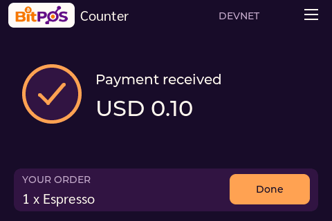
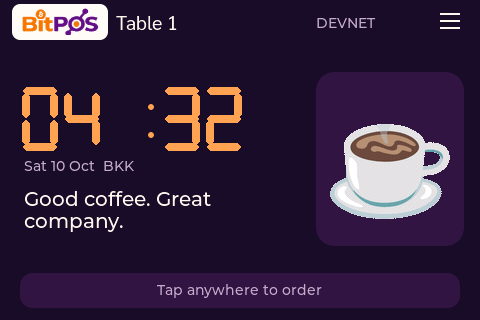

# OCI deployment acceptance

Verified on **10 October 2026, Thailand**, using firmware **0.3.6** on the identity-checked ESP32-S3 terminal.

## Server independence

The application API, worker, Astro web server, customer/merchant/guide proxies and named Cloudflare Tunnel run on OCI against the existing dedicated BitPOS Supabase installation. Mac application services, all BitPOS tunnel connectors and DB/Auth SSH forwarding were stopped during these checks. No Mac listener remained on ports 3001/4321/4323/4324/4325. The Mac was a signing test client and USB observer; it did not serve the application or forward database traffic.

## Three live devnet payments

| Round | Order source | Backend verification → physical render ACK | Chain proof |
| --- | --- | --- | --- |
| 1 | Counter | 404 ms | [Finalized transaction](https://explorer.solana.com/tx/2hsPeEiPCWE7ZyF675SVQirPoc6iBu78cQEnkHRrH4SiyH4BytHmeS4byJohzifTEcxMDDCbe3KBkWjnE5GmHQy3?cluster=devnet) |
| 2 | Table guest | 344 ms | [Finalized transaction](https://explorer.solana.com/tx/24KU5iH2dtgwL5qGpC6VGpzeu8ffMxsEsakXuSAcg7R8M54s9fwc3GHKXbBM5nNvpvRFaLY9KbUuifScZsseissz?cluster=devnet) |
| 3 | Counter | 329 ms | [Finalized transaction](https://explorer.solana.com/tx/2s8CvkYprpWwcXdFxJP45cCrqhRGuvSuGNRVZ1XteX1uRPr666ArGHinSEjApaNiXTa5pcH98n2eLT8exJrg2zJy?cluster=devnet) |

These are **three individual measurements**, not a p95 estimate and not the wallet-approval/chain-finalization duration. No failed/slow payment observation was removed from this cohort. The third transaction followed an OCI API/worker restart. The terminal stayed on the same 0.3.6 source throughout.

All three transactions finalized successfully. The payer's native SOL balance was unchanged; the server fee sponsor paid network fees. Each order has exactly one attempt, one settled payment and one consumed sound effect. Espresso stock changed from 196 to 193; final reservations were zero. Resubmitting the exact signed third transaction returned the original signature and did not create an additional settlement.

Counter orders retained the paired POSClock. The table order retained its table and device. No transaction was routed to another device. Restart recovery restored the paid receipt; serial logs recorded sound suppression for replayed snapshots. The third payment recorded a single WAV payment sound.

## Native screen and Done

These images come from the real terminal's LVGL RGB565 framebuffer after LCD DMA, with its reported 0.3.6 version and payload checksum checked. They are not rendered web mockups; framebuffer evidence alone does not prove optical output or human touch. Authenticated server render ACKs and serial records provide the separate delivery evidence.

Customer Done was checked in the real browser for all three payments. The customer returned to the table menu after 10.3–11.1 seconds; server device state returned to idle, online, with no retained order. Native HOME/coffee animation was captured afterward.

## Source and access

The public `cryptoclocks/BitPOS` repository includes application code, firmware, migrations, public assets, tests and OCI deployment manifests. An anonymous clean clone installed frozen dependencies, passed typecheck and web build, and ran 37 passing unit/source tests with 55 integration tests explicitly skipped. Backend authorization integration was run separately against the configured database. Deployment secrets, customer signing wallets, backups and runtime journals were excluded from publication.

Owner/Manager/Staff login and menu reads were checked. Manager/Staff treasury writes and foreign-origin shortcut login were rejected. Public customer, guide and device-host route separation was checked. Public pages and referenced same-origin assets loaded successfully.

## Practical limits

- This remains **Solana devnet**, using the Paxos sandbox USDG token. It is not a mainnet deployment or a claim about redeemable funds.
- Transactions were signed by a private host-wallet test client. Physical Android Phantom scanning/provider approval remains the separately deferred manual check.
- POSClock needs power and an Internet-connected 2.4 GHz WiFi network. For a portable hotspot, configure its SSID/password to match the terminal's saved network, or provision the terminal for that network privately.
- The Mac-off conclusion comes from stopped application/forwarding processes and successful direct public WSS/payment operation. The Mac stayed powered on for the signing client and USB observation; it was not physically shut down during measurement.
